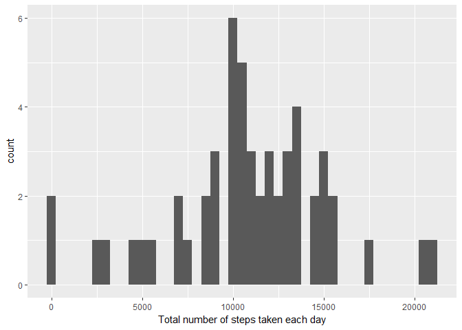
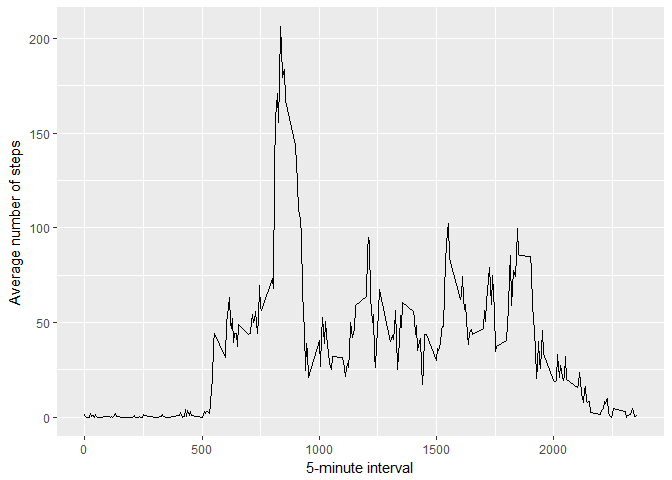
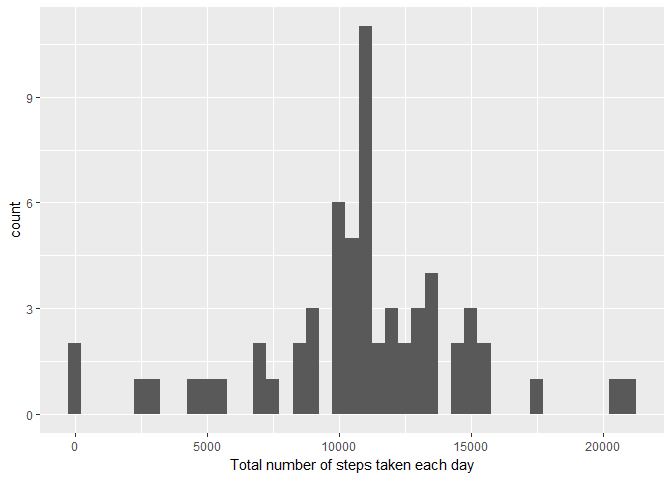
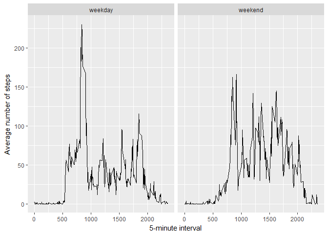

# Reproducible Research: Peer Assessment 1
Adam Rubins  
2017-09-10  

## libraries setup

```r
library(tidyverse)
```

```
## Loading tidyverse: ggplot2
## Loading tidyverse: tibble
## Loading tidyverse: tidyr
## Loading tidyverse: readr
## Loading tidyverse: purrr
## Loading tidyverse: dplyr
```

```
## Conflicts with tidy packages ----------------------------------------------
```

```
## filter(): dplyr, stats
## lag():    dplyr, stats
```

```r
library(lubridate)
```

```
## 
## Attaching package: 'lubridate'
```

```
## The following object is masked from 'package:base':
## 
##     date
```

```r
library(knitr)
```
## A brief description of the data
This assignment makes use of data from a personal activity monitoring device. This device collects data at 5 minute intervals through out the day. The data consists of two months of data from an anonymous individual collected during the months of October and November, 2012 and include the number of steps taken in 5 minute intervals each day.

The variables included in this dataset are:

* steps: Number of steps taking in a 5-minute interval (missing values are coded as NA)
* date: The date on which the measurement was taken in YYYY-MM-DD format
* interval: Identifier for the 5-minute interval in which measurement was taken

The dataset is stored in a comma-separated-value (CSV) file and there are a total of 17,568 observations in this dataset.

# Loading and preprocessing the data

## Load the data

* Download and unzip the data file

```r
data_Url <- "https://github.com/Rub123/RepData_PeerAssessment1/raw/master/activity.zip" 
file_Name <- "activity.zip"
download.file(data_Url, file_Name)   
unzip(file_Name)
```
the data file was Download from [here](https://github.com/Rub123/RepData_PeerAssessment1/raw/master/activity.zip)
on 2017-09-10

 
* Read the data into R 

```r
activity <- read_csv("activity.csv",
                     na = "NA",
                     col_names = TRUE,
                     col_types = cols(
                         col_integer(),
                         col_date(format = "%Y-%m-%d"),
                         col_integer()
                    )
            )
```

## Process/transform the data
*assumption: ignoring the missing values in the dataset for this part.*

```r
activity_per_day <- activity %>%
    filter(!is.na(steps)) %>%
    group_by(date)  %>%
    summarise(total.steps.per.day = sum(steps),
              mean.steps.per.day = mean(steps),
              median.steps.per.day = median(steps)
    )
```
# What is mean total number of steps taken per day?

## Calculate the total number of steps taken per day (and also Mean and median per day)

* data per day: Total, Mean and median per day table

```r
activity_per_day %>%
    select(date,
           Total = total.steps.per.day,
           Mean = mean.steps.per.day,
           Median = median.steps.per.day
           ) %>%
    kable(format = "markdown")
```


|date       | Total|       Mean| Median|
|:----------|-----:|----------:|------:|
|2012-10-02 |   126|  0.4375000|      0|
|2012-10-03 | 11352| 39.4166667|      0|
|2012-10-04 | 12116| 42.0694444|      0|
|2012-10-05 | 13294| 46.1597222|      0|
|2012-10-06 | 15420| 53.5416667|      0|
|2012-10-07 | 11015| 38.2465278|      0|
|2012-10-09 | 12811| 44.4826389|      0|
|2012-10-10 |  9900| 34.3750000|      0|
|2012-10-11 | 10304| 35.7777778|      0|
|2012-10-12 | 17382| 60.3541667|      0|
|2012-10-13 | 12426| 43.1458333|      0|
|2012-10-14 | 15098| 52.4236111|      0|
|2012-10-15 | 10139| 35.2048611|      0|
|2012-10-16 | 15084| 52.3750000|      0|
|2012-10-17 | 13452| 46.7083333|      0|
|2012-10-18 | 10056| 34.9166667|      0|
|2012-10-19 | 11829| 41.0729167|      0|
|2012-10-20 | 10395| 36.0937500|      0|
|2012-10-21 |  8821| 30.6284722|      0|
|2012-10-22 | 13460| 46.7361111|      0|
|2012-10-23 |  8918| 30.9652778|      0|
|2012-10-24 |  8355| 29.0104167|      0|
|2012-10-25 |  2492|  8.6527778|      0|
|2012-10-26 |  6778| 23.5347222|      0|
|2012-10-27 | 10119| 35.1354167|      0|
|2012-10-28 | 11458| 39.7847222|      0|
|2012-10-29 |  5018| 17.4236111|      0|
|2012-10-30 |  9819| 34.0937500|      0|
|2012-10-31 | 15414| 53.5208333|      0|
|2012-11-02 | 10600| 36.8055556|      0|
|2012-11-03 | 10571| 36.7048611|      0|
|2012-11-05 | 10439| 36.2465278|      0|
|2012-11-06 |  8334| 28.9375000|      0|
|2012-11-07 | 12883| 44.7326389|      0|
|2012-11-08 |  3219| 11.1770833|      0|
|2012-11-11 | 12608| 43.7777778|      0|
|2012-11-12 | 10765| 37.3784722|      0|
|2012-11-13 |  7336| 25.4722222|      0|
|2012-11-15 |    41|  0.1423611|      0|
|2012-11-16 |  5441| 18.8923611|      0|
|2012-11-17 | 14339| 49.7881944|      0|
|2012-11-18 | 15110| 52.4652778|      0|
|2012-11-19 |  8841| 30.6979167|      0|
|2012-11-20 |  4472| 15.5277778|      0|
|2012-11-21 | 12787| 44.3993056|      0|
|2012-11-22 | 20427| 70.9270833|      0|
|2012-11-23 | 21194| 73.5902778|      0|
|2012-11-24 | 14478| 50.2708333|      0|
|2012-11-25 | 11834| 41.0902778|      0|
|2012-11-26 | 11162| 38.7569444|      0|
|2012-11-27 | 13646| 47.3819444|      0|
|2012-11-28 | 10183| 35.3576389|      0|
|2012-11-29 |  7047| 24.4687500|      0|


## A histogram of the total number of steps taken each day


```r
ggplot(data = activity_per_day) +
    geom_histogram(mapping = aes(x = total.steps.per.day), binwidth  = 500) +
    xlab("Total number of steps taken each day")
```

<!-- -->

## Calculate and report the mean and median of the total number of steps taken per day

the mean and median of the total number of steps per day, across all days

```r
activity_per_day %>%
    summarise("mean of the total number of steps per day" = mean(total.steps.per.day),
              "median of the total number of steps per day" = median(total.steps.per.day)
              ) %>%
    kable(format = "markdown")
```


| mean of the total number of steps per day| median of the total number of steps per day|
|-----------------------------------------:|-------------------------------------------:|
|                                  10766.19|                                       10765|

# What is the average daily activity pattern?

## Make a time series plot of the 5-minute interval (x-axis) and the average number of steps taken, averaged across all days (y-axis)

```r
average_daily_activity <- activity %>%
    filter(!is.na(steps)) %>%
    group_by(interval) %>%
    summarise(average = mean(steps))

ggplot(data = average_daily_activity) +
    geom_line(mapping = aes(x = interval, y= average)) + 
    xlab("5-minute interval") +
    ylab("Average number of steps")
```

<!-- -->

## Which 5-minute interval, on average across all the days in the dataset, contains the maximum number of steps?

```r
activity %>%
    filter(!is.na(steps)) %>%
    group_by(interval) %>%
    summarise(average = mean(steps)) %>%
    filter(average == max(average)) %>%
    select(interval) %>%
    kable(format = "html")
```

<table>
 <thead>
  <tr>
   <th style="text-align:right;"> interval </th>
  </tr>
 </thead>
<tbody>
  <tr>
   <td style="text-align:right;"> 835 </td>
  </tr>
</tbody>
</table>
# Imputing missing values
*Note that there are a number of days/intervals where there are missing values (coded as NA). The presence of missing days may introduce bias into some calculations or summaries of the data.*

## Calculate and report the total number of missing values in the dataset (i.e. the total number of rows with NAs)

```r
activity %>%
    filter(is.na(steps)) %>%
    summarise("Number of missing values in the dataset" =n()) %>%
    kable(format = "html")
```

<table>
 <thead>
  <tr>
   <th style="text-align:right;"> Number of missing values in the dataset </th>
  </tr>
 </thead>
<tbody>
  <tr>
   <td style="text-align:right;"> 2304 </td>
  </tr>
</tbody>
</table>

## Devise a strategy for filling in all of the missing values in the dataset.

The strategy isn't sophisticated. I will use the mean for that 5-minute interval across all days (as was suggested assignment instructions)

## Create a new dataset that is equal to the original dataset but with the missing data filled in

```r
activity_na_filled <- left_join(activity,average_daily_activity, by = "interval") %>%
    mutate(steps = if_else(is.na(steps),
                           as.double(average),
                           as.double(steps)
                           )
           ) %>%
    select(-average)
```
## Make a histogram of the total number of steps taken each day

```r
activity_per_day_na_filled <- activity_na_filled %>%
    group_by(date)  %>%
    summarise(total.steps.per.day = sum(steps))

histogram_na_filled <- ggplot(data = activity_per_day_na_filled) +
    geom_histogram(mapping = aes(x = total.steps.per.day), binwidth  = 500) +
    xlab("Total number of steps taken each day")
print(histogram_na_filled)    
```

<!-- -->

###  Calculate and report the mean total number of steps taken per day

```r
activity_per_day_na_filled %>%
    summarise(mean = mean(total.steps.per.day)) %>%
    kable(format = "html")
```

<table>
 <thead>
  <tr>
   <th style="text-align:right;"> mean </th>
  </tr>
 </thead>
<tbody>
  <tr>
   <td style="text-align:right;"> 10766.19 </td>
  </tr>
</tbody>
</table>

### Calculate and report the median total number of steps taken per day

```r
activity_per_day_na_filled %>%
    summarise(median = median(total.steps.per.day)) %>%
    kable(format = "html")
```

<table>
 <thead>
  <tr>
   <th style="text-align:right;"> median </th>
  </tr>
 </thead>
<tbody>
  <tr>
   <td style="text-align:right;"> 10766.19 </td>
  </tr>
</tbody>
</table>

### Do these values differ from the estimates from the first part of the assignment?

there is no significant difference in the mean and median values.


### what is the impact of imputing missing data on the estimates of the total daily number of steps?

imputing missing data didn't affected the estimates of the total daily number of steps.
but it could be because of the strategy for mputing missing values that was chosen


# Are there differences in activity patterns between weekdays and weekends?

*Useing the dataset with the filled-in missing values for this part*

## Create a new factor variable in the dataset with two levels – “weekday” and “weekend” indicating whether a given date is a weekday or weekend day.

```r
activity_na_filled <- activity_na_filled %>%
    mutate(dayType = if_else(wday(date) == 1 | wday(date) == 7,
                                               "weekend",
                                               "weekday"
                                               ),
                             dayType = as.factor(dayType)
                             ) 
str(activity_na_filled)
```

```
## Classes 'tbl_df', 'tbl' and 'data.frame':	17568 obs. of  4 variables:
##  $ steps   : num  1.717 0.3396 0.1321 0.1509 0.0755 ...
##  $ date    : Date, format: "2012-10-01" "2012-10-01" ...
##  $ interval: int  0 5 10 15 20 25 30 35 40 45 ...
##  $ dayType : Factor w/ 2 levels "weekday","weekend": 1 1 1 1 1 1 1 1 1 1 ...
```

## Make a panel plot containing a time series plot (i.e. type = "l") of the 5-minute interval (x-axis) and the average number of steps taken, averaged across all weekday days or weekend days (y-axis). 

```r
average_daily_activity_na_filled <- activity_na_filled %>%
    ungroup() %>%
    group_by(interval, dayType) %>%
    summarise(average = mean(steps))

ggplot(data = average_daily_activity_na_filled) +
    geom_line(mapping = aes(x = interval, y= average)) + 
    facet_grid(. ~ dayType) +
    xlab("5-minute interval") +
    ylab("Average number of steps")
```

<!-- -->
